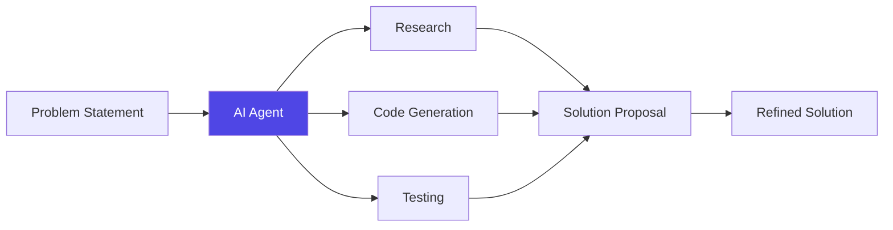

---
theme: default
background: https://source.unsplash.com/collection/94734566/1920x1080
class: text-center
highlighter: shiki
lineNumbers: false
drawings:
  persist: false
transition: slide-left
title: Vibe Coding with AI
mdc: true
---

# Vibe Coding with AI
## How LLMs & AI Agents are Transforming Development

<div class="pt-12">
  <span @click="$slidev.nav.next" class="px-2 py-1 rounded cursor-pointer" hover="bg-white bg-opacity-10">
    Press Space for next page <carbon:arrow-right class="inline"/>
  </span>
</div>

<div class="abs-br m-6 flex gap-2">
  <a href="https://github.com/slidevjs/slidev" target="_blank" alt="GitHub" title="Open in GitHub"
    class="text-xl slidev-icon-btn opacity-50 !border-none !hover:text-white">
    <carbon-logo-github />
  </a>
</div>

---
layout: image-right
image: https://source.unsplash.com/collection/94734566/1920x1080
---

# What is "Vibe Coding"?

A philosophy that prioritizes:

- 😌 **Developer Happiness** - Enjoy the process
- 🌊 **Flow State** - Maintain momentum and creativity
- 🧘 **Intuitive Solutions** - Go with what feels right
- 🎭 **Personal Expression** - Code reflects your style
- 🔄 **Iterative Progress** - Evolve your code organically

<br>

<v-click>

>"Good vibes lead to good code."

</v-click>

---
transition: fade-out
---

# The AI Revolution in Coding

<div grid="~ cols-2 gap-4">
<div>

## Traditional Coding
- Manual documentation lookup
- Time spent on boilerplate
- Searching for solutions
- Lengthy debugging cycles
- Working alone on problems

</div>
<div>

## AI-Enhanced Coding
- Instant knowledge access
- Auto-generated scaffolding
- Suggested implementations
- Intelligent error detection
- Collaborative problem-solving

</div>
</div>

<div class="mt-12 flex justify-center">
  <div class="text-center p-4 bg-gradient-to-r from-blue-500 to-purple-500 rounded-lg text-white">
    <carbon:arrow-up class="inline text-xl" /> 
    <span class="text-xl ml-2">Developer Productivity & Satisfaction</span>
  </div>
</div>

---
layout: two-cols
class: px-2
---

# LLMs: Your Coding Companion

<v-clicks>

- **Code Completion & Suggestions**
  - Context-aware completions
  - Function recommendations

- **Natural Language → Code**
  - Express ideas in plain language
  - Get functional code in return

- **Documentation Generation**
  - Auto-document functions and classes
  - Create readable explanations

</v-clicks>

::right::

<div class="ml-4">

```typescript {all|2|4-8|all}
// Express your intention in natural language
// "Create a function that formats currency"

const formatCurrency = (amount: number, 
  currency = 'USD', 
  locale = 'en-US') => {
  return new Intl.NumberFormat(locale, 
    { style: 'currency', currency }).format(amount);
};

// The LLM understands both the code 
// and its purpose
```

</div>

---
transition: slide-up
---

# AI Agents: Beyond Simple Assistance

<v-clicks>

- **Autonomous Problem Solving**
  - Define a goal and let AI explore solutions
  - Receive multiple implementation options

- **Continuous Learning**
  - Adapts to your coding style and preferences
  - Improves with feedback and interaction

- **Multi-step Reasoning**
  - Breaks down complex problems
  - Explains its thought process

</v-clicks>

<div class="mt-4">



</div>

---
layout: image-left
image: https://source.unsplash.com/collection/94734566/1920x1080
---

# Finding Your Coding Vibe with AI

<v-clicks>

- **Personalized Workflows**
  - Configure AI to match your style
  - Automate repetitive tasks

- **Focus on Creative Aspects**
  - Let AI handle boilerplate
  - Spend time on novel solutions

- **Balanced Collaboration**
  - AI as a partner, not a replacement
  - Human creativity + machine efficiency

- **Continuous Learning Loop**
  - AI learns from you
  - You learn new patterns from AI

</v-clicks>

---
layout: center
class: text-center
---

# Practical Examples

<div class="grid grid-cols-2 gap-8 mt-8">

<div v-click class="bg-gray-100 dark:bg-gray-800 p-4 rounded-lg">
  <h3 class="text-purple-600 dark:text-purple-400 font-bold mb-2">Refactoring Code</h3>
  <p class="text-sm">Transform legacy code to modern patterns with AI guidance</p>
  <div class="mt-2 text-xs text-left bg-black text-green-400 p-2 rounded">
    "Refactor this callback-based API to use Promises"
  </div>
</div>

<div v-click class="bg-gray-100 dark:bg-gray-800 p-4 rounded-lg">
  <h3 class="text-blue-600 dark:text-blue-400 font-bold mb-2">Debugging Assistance</h3>
  <p class="text-sm">Explain errors and get fix suggestions in plain language</p>
  <div class="mt-2 text-xs text-left bg-black text-red-400 p-2 rounded">
    "Why am I getting 'Cannot read property of undefined'?"
  </div>
</div>

<div v-click class="bg-gray-100 dark:bg-gray-800 p-4 rounded-lg">
  <h3 class="text-green-600 dark:text-green-400 font-bold mb-2">API Exploration</h3>
  <p class="text-sm">Discover and learn new libraries through conversation</p>
  <div class="mt-2 text-xs text-left bg-black text-blue-400 p-2 rounded">
    "What's the best way to handle state in this React component?"
  </div>
</div>

<div v-click class="bg-gray-100 dark:bg-gray-800 p-4 rounded-lg">
  <h3 class="text-yellow-600 dark:text-yellow-400 font-bold mb-2">Test Generation</h3>
  <p class="text-sm">Auto-create test cases based on your implementation</p>
  <div class="mt-2 text-xs text-left bg-black text-purple-400 p-2 rounded">
    "Generate unit tests for this authentication service"
  </div>
</div>

</div>

---

# Embracing the AI-Human Partnership

<v-clicks>

- **Complementary Strengths**
  - AI: Memory, consistency, pattern recognition
  - Human: Creativity, context understanding, judgment

- **Evolving Developer Skills**
  - Prompt engineering
  - AI collaboration techniques
  - Higher-level system design

- **Ethical Considerations**
  - Attribution and licensing
  - Understanding generated code
  - Maintaining quality and security

</v-clicks>

<div v-click class="mt-10 flex justify-center">
  <div class="px-4 py-2 border border-gray-400 rounded-full">
    <carbon:partnership class="inline mr-2" /> Human creativity + AI capabilities = The future of development
  </div>
</div>

---
layout: center
class: text-center
---

# Thank You!

<div class="text-xl text-gray-500 mt-4">
  Start your vibe coding journey with AI today
</div>

<div class="mt-12 grid grid-cols-2 gap-8">
  <div>
    <h3 class="text-blue-500 font-bold mb-2">Resources</h3>
    <ul class="text-sm text-left">
      <li>GitHub Copilot</li>
      <li>Lovable AI Editor</li>
      <li>ChatGPT Code Interpreter</li>
      <li>Anthropic Claude</li>
    </ul>
  </div>
  <div>
    <h3 class="text-purple-500 font-bold mb-2">Next Steps</h3>
    <ul class="text-sm text-left">
      <li>Start with simple AI-assisted tasks</li>
      <li>Learn effective prompting</li>
      <li>Join AI developer communities</li>
      <li>Share your experiences</li>
    </ul>
  </div>
</div>

