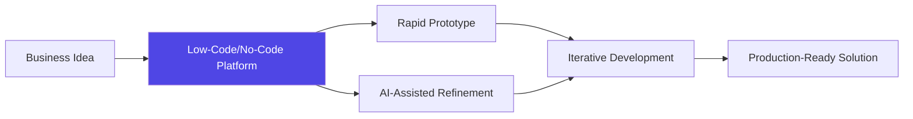

---
theme: default
background: https://source.unsplash.com/collection/94734566/1920x1080
class: text-center
highlighter: shiki
lineNumbers: false
drawings:
  persist: false
transition: slide-left
title: Accelerating Product Development with Low-Code, No-Code, and Generative AI
mdc: true
---

# Accelerating Product Development
## Leveraging Low-Code, No-Code, and Generative AI Tools

<div class="pt-12">
  <span @click="$slidev.nav.next" class="px-2 py-1 rounded cursor-pointer" hover="bg-white bg-opacity-10">
    Press Space for next page <carbon:arrow-right class="inline"/>
  </span>
</div>

<div class="abs-br m-6 flex gap-2">
  <a href="https://github.com/InContextSolutions" target="_blank" alt="GitHub" title="Open in GitHub"
    class="text-xl slidev-icon-btn opacity-50 !border-none !hover:text-white">
    <carbon-logo-github />
  </a>
</div>

---
layout: image-right
image: https://source.unsplash.com/collection/94734566/1920x1080
---

# The Changing Landscape of Software Development

Key Transformation Drivers:
- 🚀 **Rapid Technological Advancement**
- 💡 **Democratization of Development**
- 🤖 **AI-Powered Tooling**
- 🌐 **Remote Collaboration**
- ⚡ **Accelerated Time-to-Market**

<br>

<v-click>

>"The future of development is about empowerment, not just coding."

</v-click>

---
transition: fade-out
---

# Low-Code, No-Code, and Generative AI Tools

<div grid="~ cols-2 gap-4">
<div>

## Traditional Development
- Complex coding requirements
- High technical barriers
- Lengthy development cycles
- Specialized skill sets needed
- Linear progress

</div>
<div>

## Modern Development Ecosystem
- Visual development interfaces
- AI-assisted coding
- Rapid prototyping
- Cross-functional collaboration
- Iterative and adaptive approaches

</div>
</div>

<div class="mt-12 flex justify-center">
  <div class="text-center p-4 bg-gradient-to-r from-blue-500 to-purple-500 rounded-lg text-white">
    <carbon:arrow-up class="inline text-xl" /> 
    <span class="text-xl ml-2">Productivity and Innovation Acceleration</span>
  </div>
</div>

---
layout: two-cols
class: px-2
---

# Key Tools and Platforms

<v-clicks>

- **Generative AI Development Tools**
  - GitHub Copilot
  - Cursor
  - Sourcegraph Cody
  - OpenAI Codex

- **Low-Code/No-Code Platforms**
  - Lovable.dev
  - Bubble
  - Webflow
  - Airtable
  - Zapier

</v-clicks>

::right::

<div class="ml-4">

```typescript {all|2|4-8|all}
// AI-assisted code generation example
// Using GitHub Copilot to create a utility function

const generateUniqueId = (prefix = 'app', 
  length = 8, 
  charset = 'alphanumeric') => {
  // AI can help generate secure, random identifiers
  return crypto.randomBytes(length)
    .toString('hex')
    .slice(0, length);
};

// Demonstrates how AI tools can 
// accelerate development tasks
```

</div>

---
transition: slide-up
---

# Benefits of Modern Development Approaches

<v-clicks>

- **Increased Development Speed**
  - Reduce time from concept to prototype
  - Minimize repetitive coding tasks

- **Enhanced Collaboration**
  - Bridge technical and non-technical teams
  - Enable business users to contribute

- **Reduced Complexity**
  - Simplify technical debt
  - Lower barrier to entry for innovation

- **Continuous Learning**
  - Adapt to new technologies quickly
  - Stay competitive in fast-changing markets

</v-clicks>

<div class="mt-4">



</div>

---
layout: image-left
image: https://source.unsplash.com/collection/94734566/1920x1080
---

# Practical Implementation Strategies

<v-clicks>

- **Assess Current Workflows**
  - Identify bottlenecks
  - Map potential tool integrations

- **Gradual Adoption**
  - Start with small, low-risk projects
  - Build team confidence and skills

- **Training and Upskilling**
  - Workshops on new tools
  - Create internal knowledge base
  - Encourage experimentation

- **Continuous Evaluation**
  - Regular tool performance reviews
  - Stay updated with emerging technologies

</v-clicks>

---
layout: center
class: text-center
---

# Practical Examples

<div class="grid grid-cols-2 gap-8 mt-8">

<div v-click class="bg-gray-100 dark:bg-gray-800 p-4 rounded-lg">
  <h3 class="text-purple-600 dark:text-purple-400 font-bold mb-2">Rapid Prototyping</h3>
  <p class="text-sm">Build MVPs in hours, not weeks</p>
  <div class="mt-2 text-xs text-left bg-black text-green-400 p-2 rounded">
    "Create a customer feedback portal using Lovable"
  </div>
</div>

<div v-click class="bg-gray-100 dark:bg-gray-800 p-4 rounded-lg">
  <h3 class="text-blue-600 dark:text-blue-400 font-bold mb-2">AI-Assisted Development</h3>
  <p class="text-sm">Leverage AI for code generation and optimization</p>
  <div class="mt-2 text-xs text-left bg-black text-red-400 p-2 rounded">
    "Use GitHub Copilot to implement complex algorithms"
  </div>
</div>

<div v-click class="bg-gray-100 dark:bg-gray-800 p-4 rounded-lg">
  <h3 class="text-green-600 dark:text-green-400 font-bold mb-2">Cross-Functional Collaboration</h3>
  <p class="text-sm">Empower non-technical team members</p>
  <div class="mt-2 text-xs text-left bg-black text-blue-400 p-2 rounded">
    "Build internal tools with no-code platforms"
  </div>
</div>

<div v-click class="bg-gray-100 dark:bg-gray-800 p-4 rounded-lg">
  <h3 class="text-yellow-600 dark:text-yellow-400 font-bold mb-2">Workflow Automation</h3>
  <p class="text-sm">Streamline repetitive processes</p>
  <div class="mt-2 text-xs text-left bg-black text-purple-400 p-2 rounded">
    "Create automated workflows with Zapier"
  </div>
</div>

</div>

---

# Challenges and Considerations

<v-clicks>

- **Data Security**
  - Evaluate tool compliance
  - Implement robust access controls

- **Code Quality**
  - Establish review processes
  - Use AI as a tool, not a replacement

- **Learning Curve**
  - Provide comprehensive training
  - Create supportive learning environment

- **Vendor Lock-in**
  - Maintain flexibility
  - Choose platforms with export capabilities

</v-clicks>

<div v-click class="mt-10 flex justify-center">
  <div class="px-4 py-2 border border-gray-400 rounded-full">
    <carbon:partnership class="inline mr-2" /> Balancing Innovation and Prudence
  </div>
</div>

---
layout: center
class: text-center
---

# Q&A and Discussion

<div class="mt-8">
  <p class="text-xl text-gray-600">
    How can we leverage these tools to drive our product development?
  </p>
</div>

<div class="mt-12 grid grid-cols-2 gap-8">
  <div>
    <h3 class="text-blue-500 font-bold mb-2">Next Steps</h3>
    <ul class="text-sm text-left">
      <li>Tool evaluation workshop</li>
      <li>Pilot project selection</li>
      <li>Team training sessions</li>
      <li>Regular progress reviews</li>
    </ul>
  </div>
  <div>
    <h3 class="text-purple-500 font-bold mb-2">Recommended Resources</h3>
    <ul class="text-sm text-left">
      <li>GitHub Copilot Learning Path</li>
      <li>Lovable.dev Tutorials</li>
      <li>No-Code Community Forums</li>
      <li>AI in Development Webinars</li>
    </ul>
  </div>
</div>

---
layout: center
class: text-center
---

# Thank You!

<div class="text-xl text-gray-500 mt-4">
  Let's accelerate our product development together
</div>

<div class="mt-12">
  <a href="https://incontextsolutions.com" target="_blank" class="text-xl font-bold text-blue-500 hover:text-blue-600 transition-colors">
    InContext Solutions
  </a>
</div>

```

